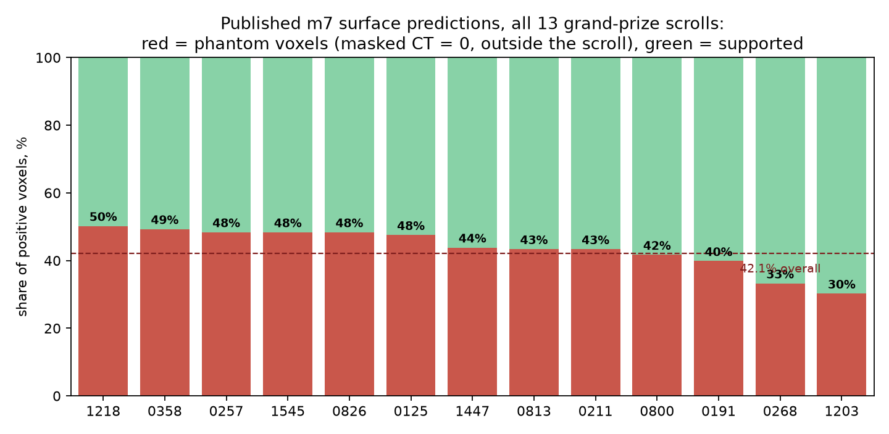

# Herculaneum Scroll Tools

Five open-source utilities for the Vesuvius Challenge, built to attack problems the
current pipeline does not address directly:

1. **Dual-energy co-rendering** — combine the two X-ray energies a scroll was scanned
   at into a single "high-Z contrast" map, surfacing metal-bearing material (a candidate
   signal for metallic inks and mineral inclusions) directly from physics, with no ML.
2. **Cross-scan registration** — align an *old* scan's coordinate frame (and every
   segmentation / label built on it) to a *newer, higher-resolution* scan of the same
   scroll, so years of prior segmentation work transfers onto the new data instead of
   being redone.
3. **CT-consistency QA** ([villa#1114](https://github.com/ScrollPrize/villa/issues/1114)) —
   measure and clean *phantom* voxels in published surface predictions; includes exact
   voxel-level phantom fractions for **the entire published m7 batch — all 36 samples**,
   including all 13 grand-prize-eligible scrolls (below).
4. **Winding-constraint annotator + verifier** — annotate winding constraints on
   flattened renders and export native spiral-input files; validated 125/125 on the
   released PHercParis4 annotations.
5. **Ink recovery at 77-78 keV** — a rendering path that reproduces the team's published
   ink maps at **r = 0.963** from the public checkpoint, the four undocumented conventions
   it depends on, and a text score calibrated at **AUC 0.885** on known writing.

Both stream data directly from the public `vesuvius-challenge-open-data` S3 bucket and
`dl.ash2txt.org` — no local copy of a full scroll is needed. Everything runs on a laptop.

MIT-licensed. Standard formats in (OME-Zarr, tifxyz, `.volpkg` affines), standard formats
out (PNG maps, NumPy arrays).

---

## 1. Dual-energy co-rendering (`dual_energy/`)

Several Herculaneum scrolls were scanned at **two X-ray energies** (e.g. PHerc0332 /
Scroll 3 at 53 keV and 70 keV). X-ray attenuation is energy-dependent, and that
dependence is much stronger for high-atomic-number (high-Z) elements than for the
carbon/organic matrix of papyrus. Taking the **ratio of the two energies** therefore
isolates dense, metal-bearing material — exactly the kind of trace-metal signature some
ancient inks carry — using nothing but physics.

**What the tool does**

- Reads the surface of a traced segment from its PPM map, samples both energy volumes
  along the surface normal (using the official `.volpkg` affine transforms to align the
  two energies), and builds a per-pixel **53/70 keV ratio map** across the whole segment.
- The legacy energy volumes are stored as *uncompressed single-strip TIFFs*, so the tool
  fetches only the rows it needs via HTTP range requests — a full segment scan streams in
  minutes without downloading the multi-hundred-GB volume.
- Resumable: every patch is cached as an `.npz`, so an interrupted scan continues where it
  stopped.

**Validation.** On Scroll 3, dense inclusions show a 53/70 ratio of ~1.13 versus ~0.97 for
background papyrus — a clear, reproducible high-Z separation (the physics works). See
`examples/dual_energy_metal_map.png` for the assembled 33 cm² map.

**Honest scope.** This surfaces *metal*, which is a *candidate* ink signal, not a proof of
text. On Scroll 3 the high-Z clusters did not form letters (its ink does not appear to be
metallic), but the tool is a general, physics-grounded contrast channel for any
dual-energy scroll, and a natural second input channel for ink-detection models.

**Run it**

```bash
pip install -r requirements.txt
# single 5x5 mm patch (quick sanity check, prints ratio stats + saves ratio/max maps):
python dual_energy/sample_patch.py --ppm <segment>.ppm --size 600 --step 2 --out_prefix demo
# full segment scan (resumable), then assemble the map:
python dual_energy/scan_segment.py        # edit PPM / volume UUIDs at the top
python dual_energy/assemble_map.py        # -> metal_map_overlay.png + density map
```

Energy volumes, affines and PPM paths are the standard `.volpkg` layout; the header of
`sample_patch.py` documents the exact Scroll-3 UUIDs used as the reference example.

---

## 2. Cross-scan registration (`registration/`)

Scrolls get re-scanned at ever higher resolution (Scroll 3: 7.91 µm in 2023 → 2.4 µm in
2025). Between scans the physical scroll is re-mounted, so the coordinate frames do **not**
match — and every segmentation, PPM and ink label built on the old scan is stranded on the
old data. This tool recovers the transform between the two frames so that prior work
transfers forward.

**Method (coarse → fine)**

1. **Coarse global alignment** at a shared downsampled resolution: recover the rigid
   relationship (in the reference example: horizontal flip + ~300.5° rotation, with a
   z-axis inversion `z_new = Z0 − z_old` and a z-linear in-plane drift). Parameters live in
   `registration/coarse_transform.json`; `map_to_new.py` exposes
   `p791L0_to_p24L0(pts)` mapping old-frame voxel coordinates to new-frame voxel
   coordinates.
2. **Fine snap to the surface.** The coarse map leaves a ±230 µm residual — larger than a
   sheet gap. `render_new_scan.py` removes it by snapping each mapped surface point, along
   its normal, to the nearest sheet in the organizers' published surface-prediction volume.
   Result: 100% of rays hit a sheet, median absolute residual ~29 µm, and a smooth offset
   field.

The payoff: you can **re-render any legacy segment window straight out of the new
high-resolution scan** (`render_new_scan.py`), inheriting the old segmentation but gaining
the new scan's detail. `examples/registration_overlay.png` shows old-vs-mapped cross
sections agreeing; `examples/rerender_from_new_scan.png` shows a legacy Scroll-3 segment
re-rendered at 4.8 µm from the 2025 scan (papyrus fibres, cracks and inclusions resolve
cleanly).

`render_tifxyz.py` is a small standalone helper: render flattened surface layers from any
`tifxyz` mesh + a scroll volume zarr, in the winners' chunk layout, ready for an
ink-detection model.

**Run it**

```bash
python registration/map_to_new.py         # sanity: prints a mapped test coordinate
python registration/render_new_scan.py --u0 <col> --v0 <row> --w 1500 --h 1245 --out demo
```

---

---

## 5. Ink recovery at 77-78 keV (`ink/`)

`scrollprize/ink_canonical_2um` is public, and so are the surface volumes it consumes.
Reproducing its output from your own surfaces is another matter: four conventions decide
the result, none of them written down anywhere, and each one is silently fatal.

| convention | getting it wrong costs |
|---|---|
| normal = `d/dcol x d/drow` of central differences on the tifxyz grid | flipping one component gives a vector that is not perpendicular to the sheet: **r = −0.18** against the published map |
| sample the volume **trilinearly**, not at the nearest voxel | r = 0.33 -> 0.44 on the same window |
| grid coordinate for output pixel `p` is `p / upsample` (cell **corner**) | the usual centre convention is off by 10 voxels at 2.4 um; layer agreement drops 0.96 -> 0.72 |
| published surface volumes index depth **opposite** to the geometric normal, one voxel per step, mesh at the centre of the 109-layer stack | the model sees the sheet inside out |

With all four right, `ink/render_surface.py` plus that checkpoint reproduces the team's
production output at **r = 0.963** on an identical crop of PHerc0139, with layer-for-layer
agreement of **0.95-0.97**. The renderer streams ranged reads straight from the public
bucket: a 34 x 32 mm segment takes about a minute on a laptop.

```bash
python ink/render_surface.py MESH_DIR VOLUME_ZARR_LEVEL0_URL OUT_DIR ROW COL ROWS COLS 20 62 0
```

Don't take the number on trust — check it:

```bash
python ink/reproduce.py
```

It downloads the checkpoint, picks a window of PHerc0139 with a moderate ink share, pulls the
team's own surface volume for it, runs the model and prints the correlation against their
published map. A clean run ends with `r = +0.915`. Anything below 0.5 means one of the four
conventions above has been broken.

### Cross-scan registration for scrolls that have no surfaces where the ink is

PHerc0009B, PHerc1203 and PHerc1451 each carry a fine 77-78 keV rescan in which ink is
visible, and segmentation **only** in the coarse 8.6-9.4 um / 113-116 keV frame. That gap,
not the ink model, is why those scrolls have no published ink.

`ink/register_scans.py` recovers the map from the volumes alone — the two scans differ by a
translation with a small linear tilt and no rotation. Match pyramid levels to a common
voxel size, cross-correlate occupancy profiles for the z shift, then cross-correlate
slices in plane. On PHerc0009B slices match at **r = 0.86**, giving

```
z_fine = z_coarse + 1376 um
y_fine = y_coarse - 1391 um + 0.0351 * z_fine
x_fine = x_coarse + 11 um
```

Applied to a mesh it lands in the right region — but it does **not** seat the surface on a
sheet, and I only found that out by building the test in the next section and turning it on my own
work. The rendered window looks like papyrus, complete with fibre texture, which is what fooled me:
a cut *across* papyrus is fibrous too. The numbers are unambiguous. `seat_mesh.sheet_contrast()`
measures how much brighter the middle of a rendered stack is than ±25 layers out; correctly seated
surfaces give **+30.0** (PHerc0139) and **+38.7** (PHercMANBp), a surface known to cut across the
windings gives **−0.1**, and this registration gives **−0.2**. So the ink maps computed from it
carry no information. Eyeballing a render is not a check; this is.

`ink/fit_seating.py` then optimises the seating score directly — rotation about z plus a
translation, coarse to fine — instead of optimising slice similarity and hoping. That is the right
objective, and on PHerc0009B it still tops out at **6.2** against the threshold of 15, from 180° of
rotation and 25 mm of shift. The conclusion is not that the search is too weak but that **the map
between these two scans is not rigid**: the scroll is handled between visits, and a rotation with a
translation cannot express what happens to it. Transferring segmentation across scans of these
scrolls needs a non-rigid method, and a slice-correlation score of 0.86 will happily hide that.

Snapping surface points onto the local sheet maximum was tried and **rejected**: on an
already correct mesh every variant (global maximum, nearest local maximum, centre of mass)
degraded the render to r = 0.34-0.71 against the unsnapped reference, because neighbouring
windings sit inside the search radius. The global transform is enough.

### Is there text here?

Ranking windows by ink fraction misleads — the highest-coverage windows are broad material
responses and the sparsest are isolated specks. `ink/text_score.py` scores line
periodicity as spectral purity in the 1.0-3.5 mm band, gated on at least three resolved
rows. Calibrated on windows of PHerc0139 where the answer is known:

| scoring rule | AUC | blank windows sent to exactly 0 |
|---|---|---|
| letter-sized blob counting | 0.699 | — |
| periodicity peak only | 0.828 | — |
| periodicity + three-row gate (shipped) | **0.885** | **92%**, losing 18% of true text |

### An ink-detectability atlas for the published corpus

Nobody had measured, systematically, where this model finds ink and where it does not.
`ink/atlas.py` samples random 512-pixel windows from the finest surface volume each scroll
publishes, runs the checkpoint, and records what comes back. 95 windows, 12 per scroll:

| scroll | µm | keV | windows | max p | windows with ink | per-window ink share (%) |
|---|---|---|---|---|---|---|
| PHerc0814 | 1.129 | 59 | 12 | 0.96 | 7/12 | 91 59 34 27 13 7 3 0 0 0 0 0 |
| PHerc0139 | 1.129 | 59 | 12 | 0.95 | 5/12 | 84 16 16 11 3 1 0 0 0 0 0 0 |
| PHerc1667 | 1.129 | 59 | 12 | 0.95 | 7/12 | 89 32 26 22 20 4 3 1 1 0 0 0 |
| PHercParis4 | 1.129 | 78 | 12 | 0.95 | 4/12 | 47 20 18 12 0 0 0 0 0 0 0 0 |
| PHerc0500P2 | 2.215 | 111 | 11 | 0.94 | 4/11 | 44 38 13 10 0 0 0 0 0 0 0 |
| PHerc0343P | 2.215 | 111 | 12 | 0.94 | 7/12 | 48 29 12 11 8 6 2 0 0 0 0 0 |
| PHerc0172 | 7.91 | 53 | 12 | 0.96 | 12/12 | 100 100 100 100 100 100 100 100 100 99 64 63 |
| PHerc1447 | 8.64 | 116 | 12 | 0.88 | 2/12 | 8 2 0 0 0 0 0 0 0 0 0 0 |

Two things fall out, and the second matters more than the ranking.

**Ink is localised, and small samples lie.** The 1.1-2.2 µm scans give a heavy-tailed
distribution — one or two windows carrying most of the ink, the rest empty. An earlier
three-window pass called PHerc0814 blank; twelve windows put it at the top of the table with a
91% window. Three windows is not a measurement.

**At ~8 µm the checkpoint saturates and must not be trusted.** PHerc0172 at 7.91 µm returns
100% ink in ten of twelve windows — not a discovery, an out-of-domain failure, since the model
was trained at ~2 µm. The practical consequence: a positive from this model on any 8-9 µm scan
carries no information, so the 113-116 keV scrolls cannot be cleared or claimed with it. That
is a caveat worth having before someone announces ink on a coarse scan.

Regenerate with `PER_SCROLL=12 python ink/atlas.py`; raw measurements are in `ink/atlas.json`.

### Which published surfaces actually sit on a sheet, and in which scan

A tifxyz file records no trace of the frame it was built in. A surface published beside a scroll
is therefore not necessarily renderable in that scroll's newest scan, and a mis-seated mesh does
not fail loudly — it renders a convincing-looking cross-section straight through the windings.
I lost most of a day to exactly that before building a test for it.

`ink/seat_mesh.py` asks the right question. Not "are these points inside material" — a cut across
the windings is inside material too — but "does the sheet run along us": sample each surface point
at 0 and at ±60 µm along its own normal, and measure how much brighter the surface is than its own
surroundings. On a seated sheet the centre sits in papyrus and both sides fall into the gaps.
Calibration: meshes known to be correct score 19-35 (PHerc0139 21.3, PHercMANBp 24.0,
PHerc1667 24.2), while a surface visibly cutting across the windings scores 8.5. The threshold is
15.

`ink/seat_survey.py` runs it over the corpus — every mesh of a scroll against every volume of that
scroll, at each plausible binning. 172 pairs, 14 scrolls (`ink/seating.json`):

| scroll | best-seating volume | scale | score | verdict |
|---|---|---|---|---|
| PHerc1667 | 20251217075048-2.399um-0.2m-78keV | 1.0 | 24.2 | **seats** |
| PHercMANBp | 20251216152116-2.399um-0.2m-78keV | 1.0 | 24.0 | **seats** |
| PHerc0139 | 20260102150214-2.399um-0.2m-78keV | 1.0 | 21.3 | **seats** |
| PHercParis4 | 20260411134726-2.400um-0.2m-78keV | 1.0 | 17.0 | **seats** |
| PHerc0814 | 20260521123630-1.129um-0.2m-59keV | 1.0 | 13.3 | partial |
| PHerc0009B | 20250521125136-8.640um-1.2m-116keV | 1.0 | 11.8 | partial |
| PHerc0500P2 | 20250526151718-2.215um-0.4m-111keV | 1.0 | 11.7 | partial |
| PHerc0172 | 20241024131839-7.910um-53keV | 1.0 | 11.5 | partial |
| PHerc1451 | 20260319101107-2.399um-0.2m-78keV | 2.0 | 9.7 | partial |
| PHerc0343P | 20260304131111-2.215um-0.4m-111keV | 1.0 | 7.3 | partial |
| PHerc0332 | 20251211183505-2.399um-0.2m-78keV | 4.0 | 4.8 | partial |
| PHerc1203 | 20250820131727-9.362um-1.2m-113keV | 1.0 | 4.3 | partial |
| PHerc0800 | 20250521135224-8.640um-1.2m-116keV | 1.0 | 2.0 | no |
| PHerc1447 | 20250521151220-8.640um-1.2m-116keV | 0.5 | 1.2 | no |

The method validates itself on the way through: for PHerc0139, whose meshes are named
`...-on-<volume-id>-...`, the search independently picks out the volume named in the filename and
rejects the other six.

**Only four of fourteen scrolls have a published surface that cleanly seats in any of their own
volumes.** For the other ten the bottleneck is not ink detection at all — there is no seated
surface in a scan fine enough to read ink from, which is a different problem needing different
work. PHerc0800 and PHerc1447 have no seated surface anywhere in the sample.

Caveat worth stating: this samples the first segment carrying meshes on each scroll and up to six
meshes from it, so a "no" is a statement about that sample, not an exhaustive proof for the scroll.

### What the maps say so far

- **PHercMANBp** — all 11 segments sampled (24 windows of 0.24 cm2 each): no text.
- **PHerc0009B** — withdrawn. The windows were rendered from a surface that the seating test
  later showed is not on a sheet, so their maps say nothing about the scroll. Left here as the
  record of a claim retracted rather than quietly deleted.
- **PHerc1447** — 8.64 µm / 116 keV: two of twelve windows return 8% and 2%, the rest nothing.
  Read together with the saturation result above, a coarse scan cannot settle the question
  either way; what it does settle is that these scrolls need a finer rescan before any ink
  claim about them means anything.

These are the first ink maps published for any of them, and they ship with the repo:
`ink/maps/<scroll>/` holds one 8-bit PNG per window plus a `manifest.json` giving the window
id, ink fraction above 0.5, maximum probability, text score and fitted line period, so every
number quoted here can be checked without rerunning anything. Regenerate with
`python ink/export_maps.py "out/*.npy" ink/maps/SCROLL SCROLL`.

`python ink/test_ink.py` covers all four conventions plus the registration primitives.

## Why these help the challenge

- **Registration** is directly reusable: it turns "we rescanned it, now re-segment
  everything" into "we rescanned it, the old segments still apply." Any scroll with an
  old + new scan pair benefits.
- **Dual-energy** adds an independent, ML-free physical contrast channel — useful both as a
  standalone metal map and as an extra input band for ink models on multi-energy scrolls.
- Both are self-contained, laptop-runnable, stream from the public buckets, and emit
  standard formats for easy integration.

Feedback and PRs welcome. Released under MIT so any of it can be folded into VC3D or the
community tooling.

---

## 3. CT-consistency QA for surface predictions (`ct_support/`)

Addresses [ScrollPrize/villa#1114](https://github.com/ScrollPrize/villa/issues/1114):
published surface-prediction volumes can contain large *phantom* regions — positive
voxels sitting where the masked CT reads exactly 0 (outside the scroll). On the
PHerc0332 m7 predictions ~70% of positive voxels are phantoms, and seed-growers that
don't consult the CT can ride the phantom shell.

`ct_support.py` streams the prediction zarr and the masked CT zarr together
(no local copies) and provides four CPU-only, resumable modes:

- **`survey`** — per-plane phantom/support statistics (spot planes or a z-stride
  across the whole scroll), JSON + CSV report;
- **`slabs`** — chunk-aligned slab survey: reads whole z-chunk slabs in bounded-memory
  Y-stripes, so **100% of transferred bytes are used** (plane mode pays ~chunk-depth×
  amplification on remote zarrs) and every plane inside a slab is measured exactly;
- **`chunks`** — per-cube support map for cube-level filtering (on PHerc0332 the
  distribution is strongly bimodal — in our 128³ test window 96.5% of cubes are
  cleanly keep/drop at a 0.5 threshold);
- **`clean`** — write a cleaned (`preds AND ct>0`) copy of a z-window to a local zarr.

**Independent reproduction of villa#1114** (this tool, 2026-07-23, live S3 objects):
planes z∈{2000, 4224, 6000} → phantom fractions **0.6810 / 0.6717 / 0.6459**, positive
counts 2,259,758 / 2,379,932 / 2,110,813 — matching the issue's reported numbers
exactly. Full strided survey report: `ct_support/survey_pherc0332.json`.

### Measured voxel-level phantom fractions — all 13 grand-prize scrolls



Exact voxel-level measurements of the published m7 surface predictions
(run `20260413222639`), preds level 0 vs. the masked CT level on the same grid,
threshold 127. Every 12th z-chunk slab, all planes inside each slab measured
exactly (`full_batch.py` is the driver; per-plane data in each
`ct_support/survey_PHerc*.json`):

| scroll (GP-eligible) | positive voxels sampled | phantom voxels | phantom % | planes measured |
|---|---|---|---|---|
| PHerc1218 | 1,199,708,221 | 602,514,869 | **50.2%** | 224 |
| PHerc0358 | 1,021,436,239 | 503,603,333 | **49.3%** | 148 |
| PHerc0257 | 9,596,604,615 | 4,643,455,605 | **48.4%** | 1728 |
| PHerc1545 | 8,511,544,764 | 4,116,708,043 | **48.4%** | 1920 |
| PHerc0826 | 9,617,341,090 | 4,651,998,256 | **48.4%** | 1536 |
| PHerc0125 | 1,177,475,648 | 559,842,643 | **47.5%** | 182 |
| PHerc1447 | 14,344,637,261 | 6,290,066,086 | **43.8%** | 2112 |
| PHerc0813 | 9,077,181,876 | 3,936,984,632 | **43.4%** | 1536 |
| PHerc0211 | 8,665,801,539 | 3,756,497,458 | **43.3%** | 1728 |
| PHerc0800 | 27,053,626,452 | 11,281,693,092 | **41.7%** | 2112 |
| PHerc0191 | 12,232,136,550 | 4,874,448,732 | **39.8%** | 1728 |
| PHerc0268 | 23,824,135,553 | 7,919,731,041 | **33.2%** | 1344 |
| PHerc1203 | 136,835,937 | 41,379,993 | **30.2%** | 38 |
| **total** | **126,458,465,745** | **53,178,923,783** | **42.1%** | **16,336** |

In other words: across 16,336 exactly-measured planes of the 13 grand-prize scrolls,
**126.5 billion prediction-positive voxels were checked and 53.2 billion of them
(42.1%) sit outside the scroll** (masked CT reads exactly 0). Roughly every second
"papyrus surface" voxel handed to teams for these scrolls is phantom. Any
grower/trainer consuming these predictions without a CT filter inherits that
contamination; `clean` mode removes it in one pass.

### The rest of the m7 batch — all 36 samples measured

The remaining 23 samples of the same prediction batch, measured the same way
(per-plane JSONs in `ct_support/`):

| sample | phantom % | positive voxels sampled | planes |
|---|---|---|---|
| PHercMANBp | **95.5%** | 33,635,665 | 43 |
| PHerc0500P2 | **84.7%** | 876,184,025 | 688 |
| PHercMANB | **77.8%** | 10,543,151,549 | 1536 |
| PHerc0009B | **69.9%** | 1,465,879,157 | 768 |
| PHerc0332 | **69.4%** | 178,528,306 | 84 |
| PHercMAN5 | **67.3%** | 1,086,916,183 | 768 |
| PHerc1299 | **65.4%** | 2,144,356,890 | 1152 |
| PHerc1451 | **59.5%** | 3,475,795,862 | 1344 |
| PHerc0846A | **58.2%** | 2,455,117,471 | 384 |
| PHerc0343P | **52.2%** | 930,500,460 | 576 |
| PHerc0814 | **51.0%** | 6,524,484,887 | 1728 |
| PHerc0846B | **50.5%** | 7,727,895,283 | 1254 |
| PHercParis4 | **49.0%** | 9,991,378,931 | 1728 |
| PHerc0841 | **47.4%** | 1,870,586,753 | 384 |
| PHerc0175A | **47.1%** | 9,255,663,035 | 1152 |
| PHerc0306B | **45.6%** | 10,923,864,913 | 1344 |
| PHerc0483A | **44.8%** | 9,896,158,872 | 1344 |
| PHerc0483B | **39.8%** | 8,434,099,832 | 1152 |
| PHerc0139 | **37.1%** | 8,499,786,481 | 1920 |
| PHerc0343 | **37.0%** | 14,500,885,560 | 1536 |
| PHerc0175B | **36.7%** | 16,950,943,195 | 1344 |
| PHerc0490B | **29.0%** | 9,885,741,658 | 960 |
| PHerc0490A | **25.9%** | 16,841,154,203 | 1138 |

**Batch grand total: 40,663 exactly-measured planes, 280,951,174,916 positive
voxels checked, 121,535,016,150 phantoms (43.3%).**

**Why direct measurement was necessary** (`ct_support/calibrate.py`): fitting
`p_voxel = 1 − (1 − p_chunk)^k` against the chunk-level audit over all 36 measured
samples gives k = 3.32 but a **max residual of 28.5 points** — e.g. PHercMANB sits at
18.5% chunk-level yet 77.8% voxel-level, while other samples at the same chunk share
measure 43–50%. Chunk-level counts cannot reliably predict voxel-level contamination;
`calibration_m7_batch.json` now carries the measured value for every sample.

### Root cause verified: the phantom halo is exactly one blend-chunk wide

The proposed mechanism in villa#1114 (empty chunks pulled into the blend window one
chunk too far in every direction, whose tiny blended values then survive the
softmax) makes a hard geometric prediction: phantom-bearing chunks can exist **only
within one chunk-width of real data** — never farther.

`ct_support/audit_ct_support.py` tests this with **zero voxel downloads**: zarr
stores omit all-zero chunks, so a key listing is an exact map of data-bearing
chunks for both the prediction volume and the masked CT. Classifying every
prediction-bearing chunk in **all 36 samples** by voxel-space Chebyshev distance to
the nearest CT-bearing chunk box:

- **1,662,405 prediction chunks total**: 83.1% overlap CT data, 16.9% sit in the
  one-chunk halo ring, and **0 chunks (0.0000, in every one of the 36 samples) lie
  beyond one 192³ chunk** of CT data.
- The per-sample halo fractions independently reproduce the villa#1114 chunk-level
  audit within rounding (e.g. PHerc0332 25.9%, PHercMANBp 48.5%, PHerc0500P2 39.8%)
  — two unrelated methods, same numbers.

Consequence for the fix: all phantom mass is the blend margin — CT-masking after
inference (or `clean` mode here) removes exactly it, and since every phantom chunk
touches the mask boundary, even a conservatively dilated mask (to respect imperfect
masks near the case/wrapping) still eliminates essentially all of it. Per-sample
reports: `ct_support/halo_*.json`.

### `surface_support` — the same question, one layer down

`audit_ct_support` measures a prediction volume. `ct_support/surface_support.py`
measures what a tracer built from one: given a tifxyz surface and the CT it
should rest on, it reports how much of the surface has material under it, writes
a per-quad map, and can emit a trimmed copy.

This is the layer where the contamination actually costs you. Traced from the
published m7 predictions of PHerc1218, **55.0% of a surface stood over voxels
where the masked CT reads exactly 0** — the 50.2% voxel-level phantom share of
that scroll propagating almost one-for-one into the geometry that ink detection
then runs on.

```bash
# how much of this surface is real?
python ct_support/surface_support.py report \
  --surface path/to/segment --ct s3://vesuvius-challenge-open-data/PHerc1218/volumes/20250521120456-8.640um-1.2m-116keV-masked.zarr/0 \
  --anon --map support.png
# quads 39,204 | supported 0.4500 | unsupported 0.5500 (21,562 quads)

# keep only the part that stands on something, with a voxel of slack for mask edges
python ct_support/surface_support.py trim \
  --surface path/to/segment --ct <ct> --out trimmed/ --dilation 1
```

`--dilation` is the dial between "the mask is tight here" and "growth has left
the scroll"; a contributor calibrating the same rule on three PHerc1218 seeds
reports one voxel of slack retaining as much surface as post-hoc trimming while
leaving the survivor 99% supported. Reads are grouped by CT chunk, so a remote
volume costs one request per touched chunk rather than one per quad. Tests:
`python -m pytest ct_support/test_surface_support.py`.

### `audit_ct_support` — one command for both questions

`ct_support/audit_ct_support.py` packages this as a two-mode CLI with a covering
test suite (10 cases on synthetic zarrs, no network), usable on any prediction
volume — local, HTTP, or object storage:

```bash
# zero-download triage: is this volume contaminated, and is it confined to the margin?
python ct_support/audit_ct_support.py chunks --anon \
  --predictions s3://vesuvius-challenge-open-data/PHerc1203/representations/predictions/surfaces/20260319130212-surface-20260413222639-surface-m7-L2-th0.2.zarr/0 \
  --ct s3://vesuvius-challenge-open-data/PHerc1203/volumes/20260319130212-2.403um-0.2m-77keV-masked.zarr/2
# prediction chunks: 7,830 | supported 0.9079 | one-chunk halo 0.0921 | beyond blend margin 0.0000 (0 chunks)   [~10 s]

# exact voxel-level fractions, every 12th chunk-aligned slab, per-plane JSON
python ct_support/audit_ct_support.py voxels --predictions preds.zarr/0 --ct ct.zarr/2 --output survey.json
```

`beyond_blend_margin` is the number to watch once the upstream fixes land: a
healthy volume should report no halo either. Run the tests with
`python -m pytest ct_support/test_audit_ct_support.py`.

```bash
PRED=https://vesuvius-challenge-open-data.s3.amazonaws.com/PHerc0332/representations/predictions/surfaces/20251211183505-surface-20260413222639-surface-m7-L2-th0.2.zarr
CT=https://vesuvius-challenge-open-data.s3.amazonaws.com/PHerc0332/volumes/20251211183505-2.399um-0.2m-78keV-masked.zarr

python ct_support/ct_support.py survey --preds $PRED --ct $CT --planes 2000,4224,6000
python ct_support/ct_support.py slabs  --preds $PRED --ct $CT --slab-stride 12 --out report.json
python ct_support/ct_support.py chunks --preds $PRED --ct $CT --z0 4224 --z1 4352 --out cubes.npz
python ct_support/ct_support.py clean  --preds $PRED --ct $CT --z0 4200 --z1 4400 --out cleaned.zarr

# measure every sample in the m7 batch (auto-discovers preds+CT on S3, resumable):
python ct_support/full_batch.py
```

---

## 4. Winding-constraint annotator + verifier (`winding/`)

Winding constraints are the organizers' stated #1 lever for unrolling scrolls at
scale ("we believe that the fastest way to unroll scrolls at scale is to develop
methods for creating winding constraints…", and explicitly: "There is no required
annotation tool or generation method" — scrollprize.org/open_problems/winding_annotations).

This module is a lightweight path: annotate on the *flattened* segment render,
export **native spiral-input files**.

- `annotator.py` — click paths on a flattened render; each collection is a
  same-winding (or relative-winding, with `wind_a`) constraint. Points are mapped
  through the segment's tifxyz to full-resolution volume voxels and written in the
  exact `same_windings.json` / `relative_windings.json` schema used by the
  spiral-input dataset (VC3D point collections) — verified against the released
  PHercParis4 files field-for-field. `--selftest` runs headless and validates the
  round-trip on a real tifxyz.
- `tifxyz_map.py` — flattened (u,v) → (x,y,z) bilinear lookup with missing-cell
  handling and remote fetch helper.
- `verify.py` — per-collection geometry report + a CT cross-section overlay with
  the umbilicus marked (see `examples/winding_verify_overlay.png`, drawn from the
  released PHercParis4 annotations over the Scroll 1 volume). Flags gross errors
  (>12σ trend outliers); honest scope note in the docstring: subtle single-gap
  hops need the spiral fit itself — the overlay is the fast human check.

Validation: on the released human-verified PHercParis4 `same_windings.json`
(125 collections, ~6k points) the verifier reports **125/125 CONSISTENT**, and
the annotator's exported files match the native schema exactly.

```bash
# annotate (GUI): draw on a flattened render, export native constraint JSONs
python winding/annotator.py --image flat.png --tifxyz /path/to/tifxyz --out out/

# verify + overlay
python winding/verify.py --constraints out/same_windings.json \
  --umbilicus umbilicus.json \
  --ct https://dl.ash2txt.org/full-scrolls/Scroll1/PHercParis4.volpkg/volumes_zarr_standardized/54keV_7.91um_Scroll1A.zarr \
  --ct-level 3 --ct-scale 8 --overlay overlay.png
```
